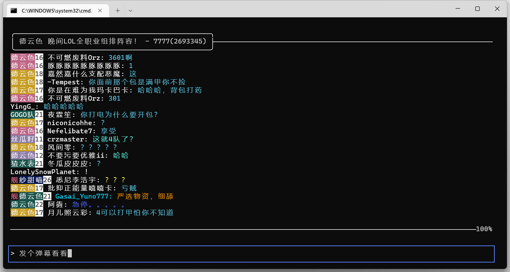

# BILILIVE_TUI
一个用于黑听B站直播的tui客户端


# 功能
- 查看弹幕、发送弹幕
- 友好的登录方式
- 彩色弹幕显示
- 自适应终端大小

# 如何使用
## 配置文件
目前配置文件比较简单，只有两个设置选项
```toml
room_id = 7777 # 想登录的直播间ID
chat_buffer = 200 # 可以回滚多少条弹幕
```

## 启动软件
### `linux`或`macos`
直接打开二进制文件即可
### `windows`
由于终端编码的支持，需要用以下参数启动
```shell
PowerShell -Command "& {[Console]::OutputEncoding = [Text.UTF8Encoding]::UTF8};.\bililive.exe"
```
或者直接运行release内的start.bat

## 登录
直接扫描二维码即可。
由于在部分终端下，二维码无法正常显示，所以同时将二维码保存为文件`login.png`,扫描该文件也可完成登录

## 操作方式
按`tab`切换区域，在上方弹幕区域可以用上下左右或者类vim的方式或这直接鼠标滚轮移动
在下方区域则可以输入弹幕按回车发送

# 计划实现的功能
- 显示高能榜
- 显示礼物、进场、SC等
- 赠送礼物
- 自动守塔
- 支持充值（真DD）
- 统计直播的数据